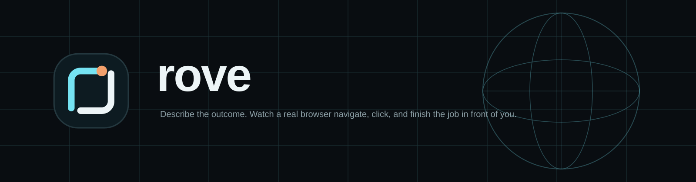
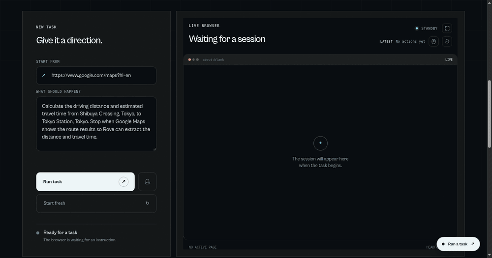

<p align="center">
  
</p>

<p align="center">
  <strong>Private, headful browser workbench for natural-language tasks.</strong>
</p>

Rove is a private, headful browser-task workbench. Give it one instruction in natural language, watch a real Chromium session work through the page, and receive a structured result when the requested information is visible.



The demo shows a real run that asks Google Maps for the driving distance and travel time between Shibuya Crossing and Tokyo Station. Rove keeps the live browser, action history, and extracted result in the same workbench.

## What Rove does

- Starts a dedicated Chromium session inside Docker.
- Observes the current page and exposes supported controls as typed actions.
- Uses Jev to choose the next operation and target.
- Executes validated actions through Chrome DevTools Protocol (CDP).
- Streams the headful browser into the workbench through noVNC.
- Extracts a verified answer from the final visible page into structured JSON.
- Keeps completed results in the current session so a follow-up instruction can continue from the same page.
- Supports stopping a run without destroying the browser session, plus starting a fresh session when needed.

Rove is designed for a private, single-user deployment. It is not a public multi-tenant service.

## What Rove can do

###  Speech commands

Enable the microphone control and speak a task. Rove uses the browser's speech-recognition API to turn spoken instructions into task text and automatically submits each command while voice mode is active. The floating voice control stays visible while listening, and queued commands can continue the current session.

###  Extracted answers

Rove does more than perform clicks. After the agent reaches a terminal state, a result verifier reads the final visible page and returns a structured result containing a summary, short facts, and the source URL. The latest answer appears in the result card, while every completed result remains available in the session archive.

###  Manual browser input

The live session starts in view-only mode. Turn on the mouse control to pass mouse and keyboard input through the embedded noVNC display when you want to take over manually. It is off by default so normal agent runs remain controlled by Rove.

## Stack and upstream projects

| Layer | Technology | Source |
| --- | --- | --- |
| Agent decision loop | Jev Ultrafast, vendored at revision `1231850a0bf1a0c0341fe408ef1668dbbfdfac46` | [browser-use/jev-ultrafast](https://github.com/browser-use/jev-ultrafast) |
| Browser control | `browser-harness==0.1.13` over CDP | [browser-use/browser-harness](https://github.com/browser-use/browser-harness) |
| Browser automation model | TypeSafe Jev API | Used by [Jev Ultrafast](https://github.com/browser-use/jev-ultrafast) |
| Browser runtime | Chromium, Xvfb, Fluxbox, x11vnc, noVNC, websockify | [Chromium](https://www.chromium.org/) · [noVNC](https://github.com/novnc/noVNC) |
| Backend | Python 3.12 standard-library HTTP server and threads | `app/server.py` |
| Frontend | Vanilla HTML, CSS, and JavaScript; GSAP is loaded for page motion | `static/` · [GSAP](https://github.com/greensock/GSAP) |
| Packaging | Docker Compose | `Dockerfile` · `docker-compose.yml` |

Rove builds on the browser-agent ecosystem maintained by [Browser Use](https://github.com/browser-use/browser-use), while the vendored Jev implementation owns the fast observe → choose → act loop.

## Jev decision loop

Rove exposes only operations and targets that the current page actually supports. Jev chooses the operation and target together in one TypeSafe request; the executor then validates the selected target again before touching the browser.

Supported operations include `CLICK`, `TYPE_TEXT`, `SELECT`, `SCROLL_UP`, `SCROLL_DOWN`, `BACK`, `RELOAD`, `KEY_ENTER`, `WAIT`, `DONE`, and `BLOCKED`.

```text
page → indexed element table → one TypeSafe request
                              ┌──────────────────────────────┐
                              │ operation                     │
                              │ click_target                  │
                              │ type_text_target              │
                              │ select_target, when available │
                              └──────────────┬───────────────┘
                                             │
                                  use the matching target
                                             │
                 CLICK [target index] ───────┤──→ browser
            TYPE_TEXT [target index] ────────┘
                                             │
                                    small text model
                                             │
                                      text → browser
```

The page snapshot owns the indexed controls. Jev cannot invent a CSS selector or an arbitrary browser command. For `TYPE_TEXT`, the separate OpenAI-compatible text model supplies only the value to enter; it does not choose the element or execute the input. For example, if the page table labels a search field `[3]` and a search button `[7]`, Jev may choose `TYPE_TEXT [3]` followed by `CLICK [7]`.

This decision-loop diagram is adapted from the [Jev Ultrafast documentation](https://github.com/browser-use/jev-ultrafast).

## How the service works

1. The browser container starts Chromium with a dedicated profile and CDP on port `9222`.
2. Rove receives a task containing a starting URL and a natural-language goal.
3. Jev receives the observed page text and a code-built action space. It returns a typed operation, target, probabilities, and confidence.
4. Rove checks that the target is still fresh and visible, then executes the action through CDP.
5. The browser is observed again. Every executed action is sent to the UI action history.
6. When the agent reaches a terminal state, the result verifier reads only the final observed page and returns:

   ```json
   {
     "kind": "answer",
     "summary": "The fastest route is 9.7 km and takes 20 minutes.",
     "facts": {
       "distance": "9.7 km",
       "travel_time": "20 min"
     },
     "source_url": "https://www.google.com/maps/..."
   }
   ```

7. The latest result is shown in the result card. Earlier results remain available in the session details view, and a continuation starts from the existing browser page rather than opening a new session.

The service has one active task at a time. The Stop control requests cooperative cancellation between browser decisions and preserves the session for continuation.

## BYOK configuration

Rove does not ship API keys. Copy the template and provide your own keys in the ignored `.env` file:

```bash
cp .env.example .env
chmod 600 .env
```

Set these values:

| Variable | Purpose |
| --- | --- |
| `TYPESAFE_API_KEY` | Required by Jev for operation and target decisions. |
| `TEXT_MODEL_API_KEY` | Used by the text helper for form values and by the final result verifier. |
| `TEXT_MODEL` | OpenAI-compatible model name for text generation and extraction. |
| `TEXT_MODEL_BASE_URL` | OpenAI-compatible `/v1` API base URL. |

`TEXT_MODEL_API_KEY` is required for tasks that need text entry and for verified answer extraction. Click-only tasks can still execute without it, but Rove cannot produce a verified answer when the result verifier is unavailable.

Never commit `.env`. Git ignores `.env` and `.env.*` while keeping `.env.example` available as a safe template. Docker also excludes environment files from its build context.

## Setup

### Requirements

- Linux host with Docker Engine and the Docker Compose plugin
- A private host interface for the published ports
- A TypeSafe API key
- An OpenAI-compatible text-model API key for typing and answer extraction

### Run the private service

```bash
git clone https://github.com/bulletsrip/rove.git
cd rove
cp .env.example .env
chmod 600 .env

# Edit .env with your own keys.
${EDITOR:-vi} .env

sudo docker compose build
sudo docker compose up -d --force-recreate
sudo docker compose ps
```

Open:

```text
http://<server-address>:8080
```

The task UI is on port `8080`. Port `6080` is the standalone noVNC fallback/debug view. Docker publishes the service ports on the server; use your VPS firewall or reverse proxy to restrict access when needed.

Useful diagnostics:

```bash
sudo docker compose logs --tail=100
curl http://<server-address>:8080/api/status
```

## API surface

The frontend uses the same small HTTP API:

| Method | Endpoint | Purpose |
| --- | --- | --- |
| `GET` | `/api/status` | Current lifecycle state, actions, latest result, and result history. |
| `POST` | `/api/tasks` | Start a fresh task with `{ "url": "...", "goal": "..." }`. |
| `POST` | `/api/tasks/continue` | Continue the existing session with `{ "goal": "..." }`. |
| `POST` | `/api/tasks/stop` | Cooperatively stop the current task. |
| `POST` | `/api/sessions` | Discard the current session and return to idle. |
| `POST` | `/api/theme` | Synchronize the desktop background with the UI theme. |

### API examples

Set the service address once for the following examples:

```bash
export ROVE_URL=http://<server-address>:8080
```

Start a fresh task. The task opens the supplied URL and lets Jev advance the browser toward the requested outcome:

```bash
curl -X POST "$ROVE_URL/api/tasks" \
  -H 'Content-Type: application/json' \
  -d '{
    "url": "https://maps.google.com",
    "goal": "Find the driving distance from Tanjung Duren to Tebet and return the distance and estimated time."
  }'
```

A successful request returns `202 Accepted` with the initial session state. Poll for progress and the extracted result:

```bash
curl "$ROVE_URL/api/status"
```

The response includes fields such as `status`, `steps`, `result`, and `result_history`:

```json
{
  "status": "answered",
  "url": "https://maps.google.com/",
  "goal": "Find the driving distance from Tanjung Duren to Tebet and return the distance and estimated time.",
  "steps": [],
  "result": {
    "kind": "answer",
    "summary": "The driving distance is 12.4 km and the estimated time is 32 minutes.",
    "facts": {
      "distance": "12.4 km",
      "estimated_time": "32 minutes"
    },
    "items": [],
    "source_url": "https://maps.google.com/"
  },
  "result_history": [],
  "can_continue": true
}
```

Continue the same browser session without reopening the URL:

```bash
curl -X POST "$ROVE_URL/api/tasks/continue" \
  -H 'Content-Type: application/json' \
  -d '{"goal":"Now compare the fastest alternative route."}'
```

Stop the current task while preserving the session for continuation:

```bash
curl -X POST "$ROVE_URL/api/tasks/stop"
```

Discard the session and return to idle before starting another fresh task:

```bash
curl -X POST "$ROVE_URL/api/sessions"
```

The API has no built-in authentication. Keep it behind your own network access controls or reverse proxy before exposing it beyond a trusted environment.

## Development checks

Run these before handing off changes:

```bash
python3 -m unittest discover -s tests -q
python3 -m compileall -q app vendor/jev_ultrafast
node --check static/app.js
docker compose config
sudo docker compose build
```

## Project layout

```text
app/server.py                 HTTP API, task lifecycle, continuation, cancellation
app/results.py                Final-page result extraction and JSON validation
static/                       Rove workbench HTML, CSS, JavaScript, and brand assets
vendor/jev_ultrafast/         Pinned Jev Ultrafast source with Rove lifecycle changes
docker/                       Chromium supervisor, container entrypoint, noVNC canvas
tests/                        API, browser lifecycle, extraction, and regression tests
docs/rove-workbench-demo.gif  Recorded end-to-end workbench demonstration
```

## Scope and limitations

Rove uses an indexed, DOM-backed action space rather than a general-purpose vision agent. It works best on ordinary visible controls such as links, buttons, fields, selects, and page scrolling. Complex canvas interfaces, arbitrary keyboard widgets, inaccessible controls, and other unsupported browser surfaces may require manual browser input.

The browser remains headful and inspectable throughout a run. Treat the session and its API keys as private, and review browser actions before using Rove on consequential websites.
